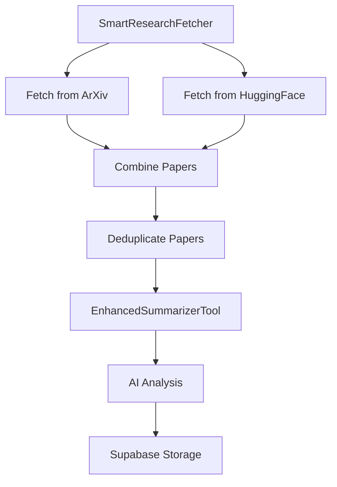

# AI Research Paper Aggregator

An intelligent research paper aggregator that combines papers from ArXiv and HuggingFace, processes them using AI, and provides an interactive interface for exploration.

## 🌟 Features

- **Smart Paper Collection**
  - ArXiv integration for AI/ML papers
  - HuggingFace trending papers
  - Automatic deduplication
  - Real-time updates

- **AI-Powered Analysis**
  - Technical summaries
  - Key contributions extraction
  - Methodology analysis
  - Significance assessment
  - Difficulty level classification

- **Interactive Dashboard**
  - Real-time paper display
  - Advanced search functionality
  - Category filtering
  - Date range queries
  - Visual analytics

## 🚀 Quick Start

### Prerequisites

- Python 3.8 or higher
- Supabase account
- OpenAI API key (for AI analysis)

### Installation

1. Clone the repository:
   ```bash
   git clone <repository-url>
   cd research-paper-aggregator
   ```

2. Install dependencies:
   ```bash
   pip install -r requirements.txt
   ```

3. Set up environment variables:
   ```bash
   # Create .env file
   SUPABASE_URL=your_supabase_url
   SUPABASE_ANON_KEY=your_supabase_key
   OPENAI_API_KEY=your_openai_key
   ```

4. Run the application:
   ```bash
   streamlit run streamlit_app.py
   ```

## 🎥 Video Demo

[](https://your-video-demo-link-here)

Watch our video demo to see the AI Research Paper Aggregator in action:
- Smart paper collection and processing
- AI-powered analysis and summarization
- Interactive dashboard features
- Real-time updates and filtering

[Click here to watch the demo](https://your-video-demo-link-here)

## 📊 Project Workflow

### 1. Paper Collection & Processing Pipeline



### 2. Detailed Components

#### A. Paper Collection Phase
- **ArXiv Fetching** (`OptimizedArXivTool`)
  - Searches AI/ML categories:
    - cs.AI (Artificial Intelligence)
    - cs.LG (Machine Learning)
    - cs.CL (NLP)
    - cs.CV (Computer Vision)
    - cs.NE (Neural Computing)
    - stat.ML (Statistical ML)
  - Fetches papers from last 7 days
  - Extracts metadata

- **HuggingFace Fetching** (`HuggingFaceSupplementTool`)
  - Fetches trending papers
  - Adds to ArXiv papers
  - Marks source as 'huggingface_trending'

#### B. AI Analysis Phase
- **Paper Summarization** (`EnhancedSummarizerTool`)
  - Generates structured summaries:
    ```python
    {
        "key_contributions": ["contribution1", "contribution2"],
        "methodology": "research approach",
        "significance": "impact analysis",
        "technical_summary": "expert overview",
        "practical_applications": "real-world uses",
        "limitations": "research limitations",
        "primary_category": "paper category",
        "difficulty_level": "Beginner/Intermediate/Advanced",
        "keywords": ["keyword1", "keyword2"]
    }
    ```

#### C. Database Storage Phase
- **Supabase Integration** (`SupabaseTool`)
  - Paper storage structure:
    ```sql
    research_papers {
        id: uuid
        title: text
        abstract: text
        authors: text[]
        primary_category: text
        technical_summary: text
        key_contributions: text[]
        methodology: text
        significance: text
        practical_applications: text
        limitations: text
        difficulty_level: text
        paper_url: text
        arxiv_id: text
        published_date: timestamp
        created_at: timestamp
    }
    ```

#### D. User Interface Phase
- **Streamlit Dashboard**
  - Real-time paper display
  - Search functionality
  - Filtering options
  - Paper visualization

## 🔧 Configuration

### Environment Variables
```
SUPABASE_URL=your_supabase_url
SUPABASE_ANON_KEY=your_supabase_key
OPENAI_API_KEY=your_openai_key
```

### YAML Configurations
- `agents.yaml`: Agent configurations
- `tasks.yaml`: Task definitions

## 📦 Dependencies

```python
# Core Dependencies
crewai-tools
langchain
supabase
streamlit
python-dotenv

# Data Processing
pandas
feedparser
requests

# AI/ML
transformers
torch
```

## 🛠️ Development

### Project Structure
```
research-paper-aggregator/
├── src/
│   └── research_crew/
│       ├── tools/
│       │   ├── arxiv_tools.py
│       │   ├── summarizer_tool.py
│       │   └── supabase_tool.py
│       ├── config/
│       │   ├── agents.yaml
│       │   └── tasks.yaml
│       └── crew.py
├── streamlit_app.py
├── requirements.txt
└── README.md
```

### Running Tests
```bash
pytest
```

## 🔄 Maintenance

### Regular Updates
- Automated paper fetching
- Database optimization
- Performance monitoring

### Database Maintenance
- Index optimization
- Data cleanup
- Performance monitoring

## 🤝 Contributing

1. Fork the repository
2. Create your feature branch (`git checkout -b feature/AmazingFeature`)
3. Commit your changes (`git commit -m 'Add some AmazingFeature'`)
4. Push to the branch (`git push origin feature/AmazingFeature`)
5. Open a Pull Request

## 📝 License

This project is licensed under the MIT License - see the [LICENSE](LICENSE) file for details.

## 🙏 Acknowledgments

- ArXiv for research paper access
- HuggingFace for trending papers
- Supabase for database infrastructure
- Streamlit for the web interface 